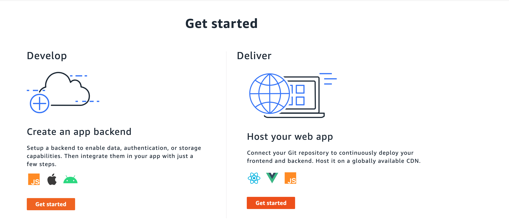
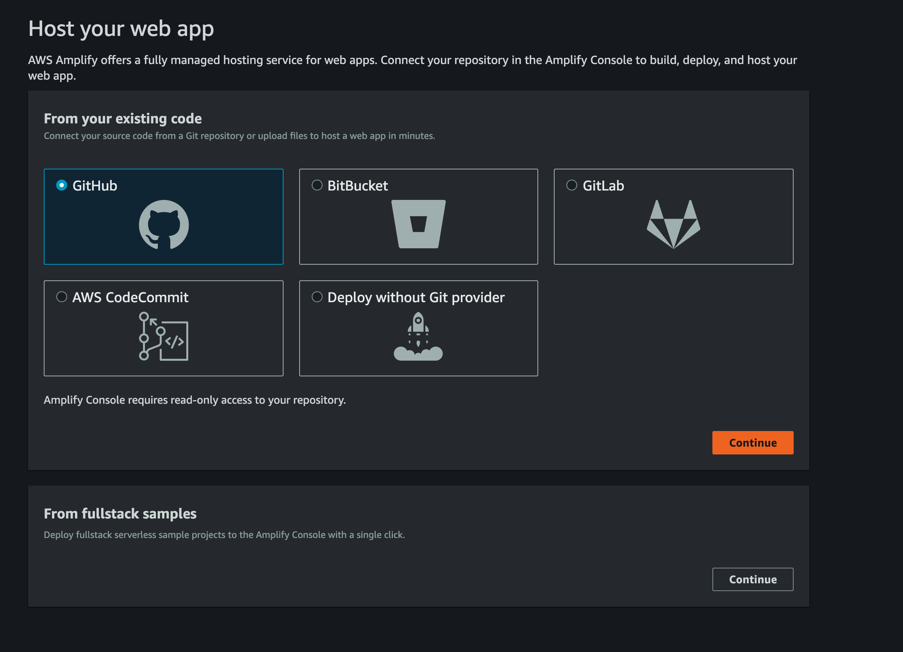
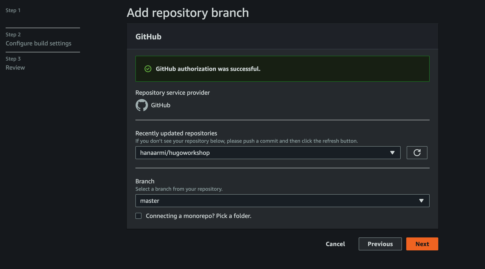
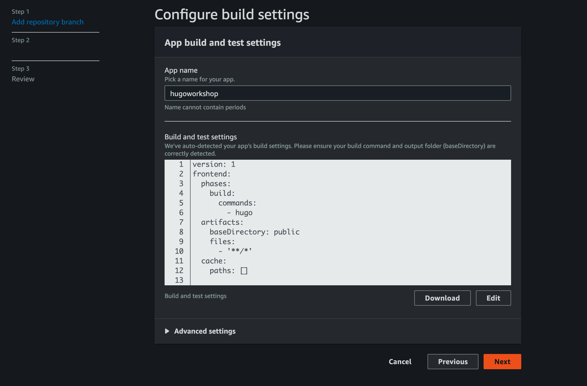
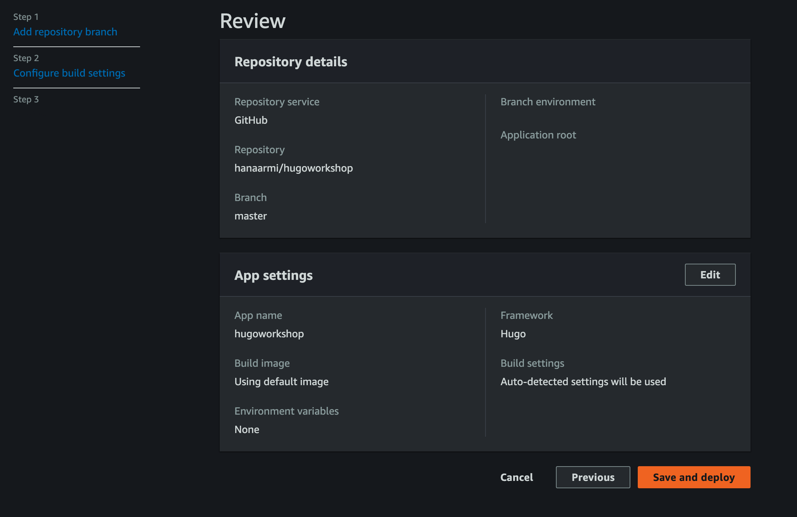
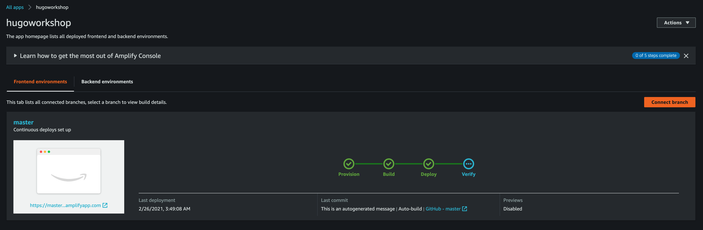
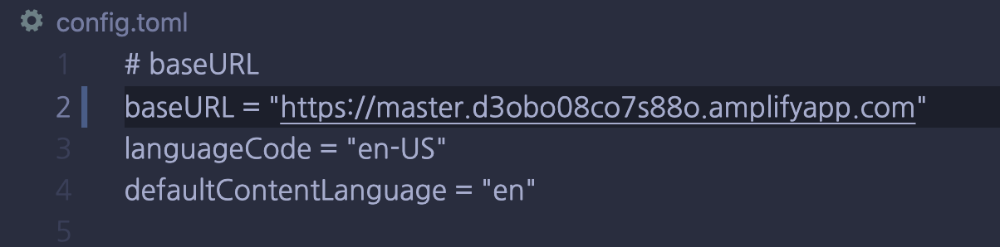
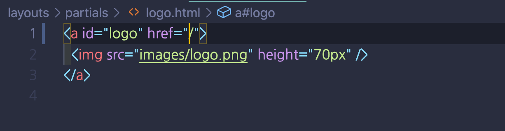

### Deploy contents to localhost

- in your directory (baseUrl), learn below command

  ```sh
  > hugo server -b localhost/hugobasedhol
  ``

  ```

- check your contents
  - http://localhost:1313/baseUrl

### Make public contents for deploy to production

- After check all contents, make deployable code and assets with below command in your baseUrl directory

  ```
  > hugo -d public
  Building sites … WARN 2021/02/26 03:17:22 .File.UniqueID on zero object. Wrap it in if or with: {{ with .File }}{{ .UniqueID }}{{ end }}
                   | EN
  -------------------+-----
  Pages            | 17
  Paginator pages  |  0
  Non-page files   |  1
  Static files     | 85
  Processed images |  0
  Aliases          |  0
  Sitemaps         |  1
  Cleaned          |  0
  Total in 64 ms
  ```

### Deploy to production using amplify

- First, need to push all hugo source code to github repository

- Move to Amplify console and choose "Host your we app"
  

- Connect to GitHub
  

- Authorize repository
  

- Configure build settings (leave it as it is)
  

- Save and deploy
  

- Provision, build, deploy, verify processes are automatically run. Copy below url https://master~
  

- After deploy, chage the link and push to github again. Amplify automatically provision again.
  
  
